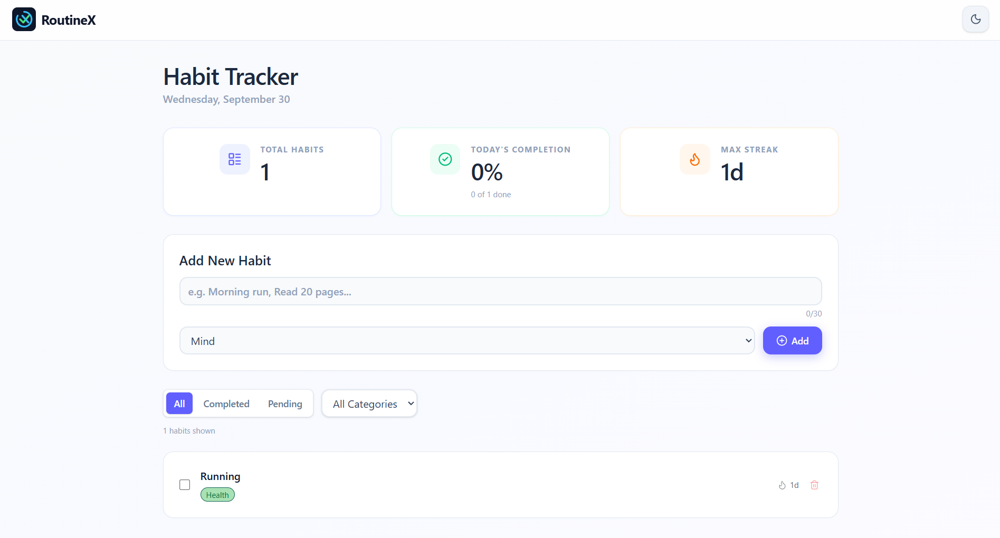

<div align="center">

# ⚡ RoutineX

**Master your daily consistency, build unbreakable habits, and visualize your progress.**

[](https://react.dev/)
[](https://vitejs.dev/)
[](https://tailwindcss.com/)
[](https://opensource.org/licenses/MIT)

</div>

---

## About

**RoutineX** is a modern, lightweight, and intuitive habit-tracking web application designed to help individuals cultivate sustainable daily routines and stay accountable. Built with **React 19**, **Vite**, and **Tailwind CSS v4**, RoutineX delivers a sleek, distraction-free environment where users can create, organize, and monitor their habits effortlessly.

Whether you're developing healthy lifestyle practices, staying on top of work goals, or cultivating mindfulness, RoutineX empowers your journey with:
- **Instant Momentum**: Track consecutive daily streaks with an automated streak engine.
- **Actionable Metrics**: Stay motivated with high-level KPI cards displaying completion rates and streak stats.
- **Frictionless Experience**: Zero authentication barrier and lightning-fast local persistence with `localStorage`.
- **Adaptive Design**: Fully tailored dark and light themes crafted for visual comfort day or night.

---

## Live Demo

Experience **RoutineX** in action:

🔗 **[Live Demo](https://routinex-react.netlify.app/)**

> *RoutineX runs entirely client-side with LocalStorage persistence — your habits remain securely stored in your browser without requiring external database setups.*

---

## 📸 Screenshots

<div align="center">
  
  <p><em>RoutineX Dashboard: Real-time progress metrics, habit creation form, category filters, and active streak counters.</em></p>
</div>

---

## 🚀 Features

- **⚡ Instant Habit Creation**:
  - Add new daily habits with custom titles and categories.
  - Built-in validation ensures meaningful habit descriptions (>3 characters) with a clean 30-character limit counter.
- **🔥 Automated Streak Engine**:
  - Automatically calculates and updates consecutive day streaks.
  - Dynamically detects consecutive days using calendar timestamps.
- **📊 Real-Time Analytics Cards**:
  - **Total Habits**: Instant count of all active habits.
  - **Today's Completion**: Live percentage metric and completion tally (`X of Y done`).
  - **Max Streak**: Highlights your best streak record across all habits.
- **🏷️ Categorization & Multi-filtering**:
  - Categorize routines into **Health**, **Work**, **Mind**, or **Other**.
  - Distinct color-coded category badges for quick visual identification.
  - Dual filtering system: Filter simultaneously by status (**All**, **Completed**, **Pending**) and by specific categories.
- **🌓 Seamless Dark / Light Mode**:
  - Thoughtfully designed dark mode (`#0F172B`) and modern light gradient theme.
  - Animated sun/moon toggle with smooth transitions and persistent state.
- **💾 Automatic LocalStorage Persistence**:
  - Habits and progress persist automatically across browser sessions, tabs, and page reloads.
- **📱 Fully Responsive & Accessible**:
  - Crafted with mobile-first responsiveness that scales seamlessly from smartphones to large desktop screens.

---

## 🎨 Design System & Aesthetics

RoutineX is designed with a premium, modern aesthetic focused on clarity, feedback, and typography:

- **Color Palette**:
  - **Dark Mode Background**: Deep cosmic slate (`#0F172B` and `#1D293D`) with subtle borders (`#314158`).
  - **Light Mode Background**: Ambient linear gradients (`slate-50`, `indigo-50/40`, `violet-50/30`) with soft shadows.
  - **Accent Colors**: Electric Indigo (`#4F39F6` / `#6366F1`), Emerald Green (`#10B981`), Warm Orange (`#F97316`), and Gold Amber (`#F59E0B`).
- **Category Badge Visual Hierarchy**:
  - 🌿 **Health**: Emerald / Mint tones (`#00D486` / `#193F47` dark, `#00754A` / `#A8E1B3` light)
  - 💼 **Work**: Slate Indigo tones (`#7C86E5` / `#28315B` dark, `#2331AF` / `#ADB6DB` light)
  - 🧠 **Mind**: Deep Violet tones (`#7C79FF` / `#2E2F5B` dark, `#060075` / `#8D92FC` light)
  - ⚡ **Other**: Warm Amber tones (`#FF9D25` / `#3F3A34` dark, `#754100` / `#FFCC96` light)
- **Micro-Interactions & Feedback**:
  - Interactive scale animations (`hover:scale-110 active:scale-95`) on controls.
  - Pulsing validation warning for short titles.
  - Glowing ambient box-shadows on buttons and active states.
  - Empty state illustration with Lucide sparkle iconography.

---

## 📁 Project Structure

```text
RoutineX/
├── public/                 # Static assets
├── src/
│   ├── assets/             # Images, icons, and screenshots
│   │   ├── favicon.svg     # RoutineX brand logo
│   │   └── Initial-UI.png  # Application screenshot
│   ├── Components/         # Modular React UI components
│   │   ├── AddNewHabit.jsx     # Form to input and validate new habits
│   │   ├── FilterRow.jsx       # Status pills & category filter dropdown
│   │   ├── HabitShow.jsx       # Habit list, badge styling, & completion toggle
│   │   ├── Header.jsx          # Title display and localized date header
│   │   ├── MaxStreak.jsx       # KPI card for highest active streak
│   │   ├── TotalCompletion.jsx # KPI card for today's completion percentage
│   │   └── TotalHabits.jsx     # KPI card for total registered habits
│   ├── context/            # Global context providers & hooks
│   │   ├── ThemeContext.js     # React theme context definition
│   │   ├── ThemeContext.jsx    # Theme provider with dark/light state
│   │   └── useTheme.js         # Custom hook for consuming theme context
│   ├── App.jsx             # Main application orchestrator & state logic
│   ├── index.css           # Tailwind CSS imports & global styles
│   ├── main.jsx            # Application entry point with ThemeProvider
│   └── Navbar.jsx          # Header navbar with logo & theme toggle
├── eslint.config.js        # ESLint configuration
├── index.html              # HTML template
├── package.json            # Project dependencies and script declarations
└── vite.config.js          # Vite build tool configuration
```

---

## ⚙️ Tech Stack

| Category | Technology | Description |
| :--- | :--- | :--- |
| **Framework** | [React 19](https://react.dev/) | Modern UI library with functional components & hooks |
| **Build Tool** | [Vite 8](https://vitejs.dev/) | Next-generation lightning-fast frontend development server |
| **Styling** | [Tailwind CSS v4](https://tailwindcss.com/) | High-performance utility-first CSS engine |
| **Icons** | [Lucide React](https://lucide.dev/) | Clean, consistent, and customizable icon library |
| **State & Context** | React Hooks (`useState`, `useEffect`, `useContext`) | Local state management and theme context propagation |
| **Persistence** | Browser `localStorage` API | Zero-config client-side habit data storage |
| **Linting** | [ESLint 10](https://eslint.org/) | Code quality and formatting enforcement |

---

## 🛠️ Installation & Setup

Follow these steps to run **RoutineX** locally on your machine:

### Prerequisites

Ensure you have **Node.js** (v18.0.0 or higher recommended) and **npm** installed on your system.
```bash
node -v
npm -v
```

### 1. Clone the Repository

```bash
git clone https://github.com/rahulsingh2007/RoutineX.git
cd RoutineX
```

### 2. Install Dependencies

```bash
npm install
```

### 3. Start the Development Server

```bash
npm run dev
```

### 4. Open in Browser

Open your browser and navigate to:
```
http://localhost:5173
```

---

## 🏃‍♂️ Available Scripts

In the project directory, you can run the following commands:

| Command | Action |
| :--- | :--- |
| `npm run dev` | Starts the Vite local development server with Hot Module Replacement (HMR). |
| `npm run build` | Bundles and optimizes the production-ready application into the `dist/` folder. |
| `npm run preview` | Runs a local web server to preview the built production output. |
| `npm run lint` | Analyzes code for potential errors and code style inconsistencies using ESLint. |

---

## 📝 License

This project is licensed under the **MIT License**. Feel free to use, modify, and distribute this project as per the terms of the license.

---

<div align="center">
  Developed with ❤️ by <a href="https://github.com/rahulsingh2007">Rahul Singh</a>
</div>